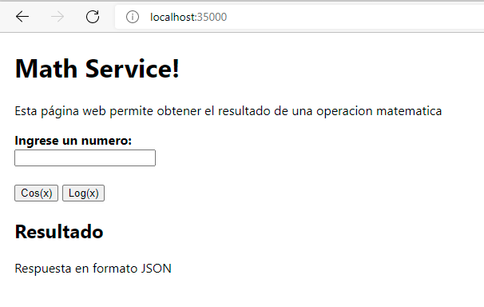
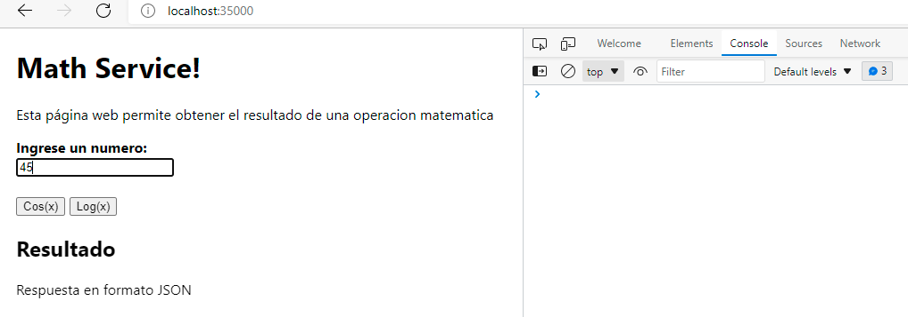
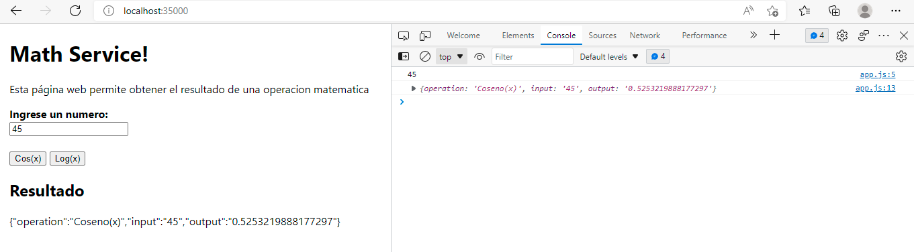
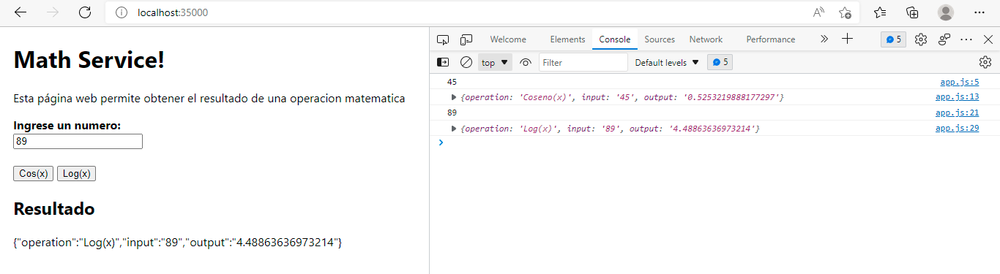

# Parcial 2 AREP

## Estrucruta

* main.java.arep.controllers --> LogService.java **(MathServices)**

* main.java.arep --> MathResponse.java **(Client y Service Proxy)**
* main.java.arep --> RoundRobin.java **(Client y Service Proxy)**
* main.java.arep --> SparkWebApp.java **(Client y Service Proxy)**

## Funcionamiento

